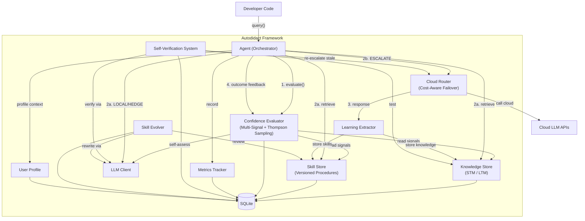
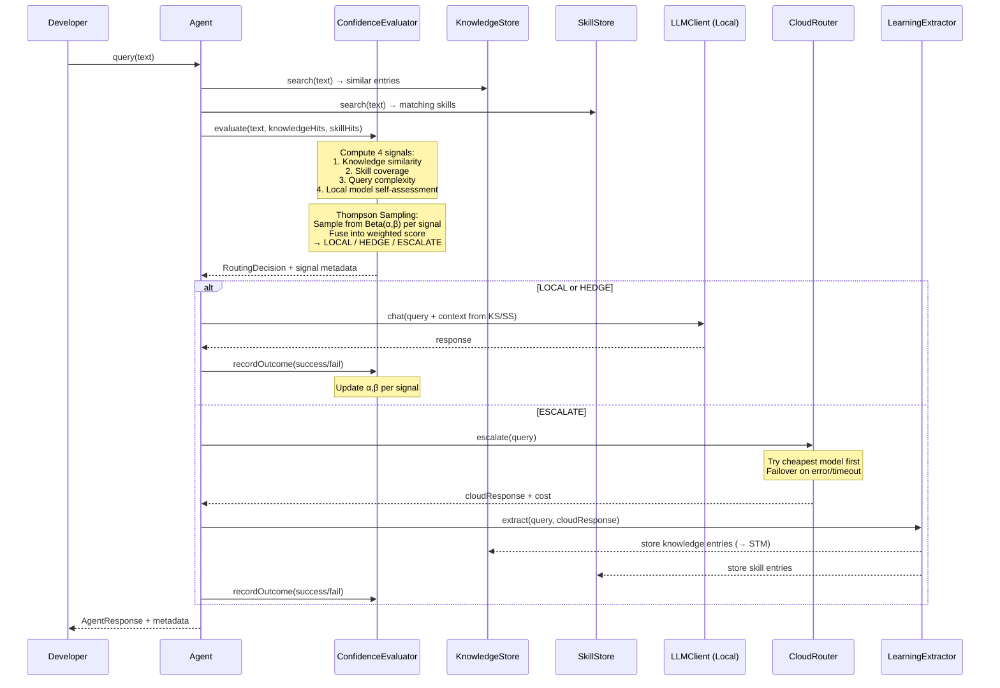
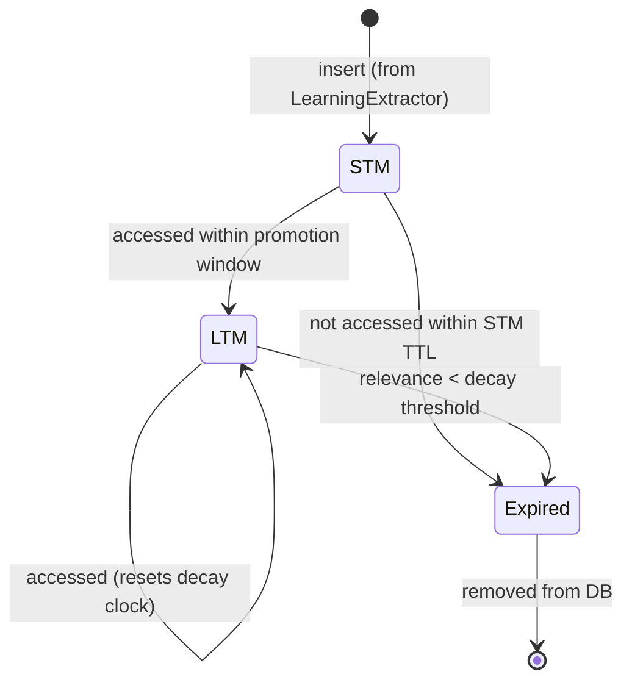

# Design Document: Autodidact Framework

## Overview

Autodidact is a local-first, self-learning AI agent framework delivered as a TypeScript/Node.js SDK. The framework enables developers to build agents that start with minimal knowledge, escalate uncertain queries to cloud models, extract reusable knowledge and skills from every escalation, and progressively resolve more queries locally — becoming cheaper, faster, and more private over time.

Phase 1 delivers the core framework: a multi-signal confidence router (ATLAS-inspired), tiered memory with Ebbinghaus decay, a procedural skill store, cost-aware cloud routing, and a self-verification loop. All state lives in a single SQLite file via `better-sqlite3`. The framework is model-agnostic (any OpenAI-compatible API), privacy-first (local by default), and exposes a pure programmatic API — no UI, no server.

### Key Design Decisions

1. **Thompson Sampling for routing** — Rather than hand-tuned thresholds, the confidence router uses a Bayesian bandit (Beta distributions per signal) to learn optimal routing weights from outcome feedback. This lets the system self-calibrate without manual tuning.
2. **STM/LTM with Ebbinghaus decay** — Inspired by ATLAS's Pattern Cache. New knowledge enters STM (short TTL), gets promoted to LTM on repeated access, and decays via the Ebbinghaus forgetting curve. This naturally prunes stale knowledge without manual cleanup.
3. **Single SQLite file** — All state (knowledge, skills, metrics, Thompson parameters, embeddings) persists in one portable `.db` file. No external databases, no network dependencies for state.
4. **Pluggable component interfaces** — Every major component (LLM client, knowledge store, skill store, cloud router) is defined as a TypeScript interface. Developers can swap implementations without touching framework internals.

## Architecture

### High-Level System Architecture



### Query Lifecycle Flow



### Architecture Principles

- **Framework/SDK** — No UI, no HTTP server. Pure importable TypeScript modules.
- **Model-agnostic** — Any OpenAI-compatible chat completions API (Ollama, vLLM, OpenAI, Anthropic).
- **Privacy-first** — Local by default. Cloud escalation is opt-in and cost-controlled.
- **Single-file state** — All persistence in one SQLite database. Portable, backupable, inspectable.
- **Pluggable** — TypeScript interfaces for all major components. Swap any implementation.

## Components and Interfaces

### Component Overview

| Component | Responsibility | Interface |
|-----------|---------------|-----------|
| `Agent` | Orchestrates query lifecycle, feedback loop, metrics | `IAgent` |
| `ConfidenceEvaluator` | Multi-signal routing with Thompson Sampling | `IConfidenceEvaluator` |
| `KnowledgeStore` | Tiered STM/LTM storage with vector search | `IKnowledgeStore` |
| `SkillStore` | Versioned procedural memory with metrics | `ISkillStore` |
| `LearningExtractor` | Extracts knowledge + skills from cloud responses | `ILearningExtractor` |
| `CloudRouter` | Cost-ordered cloud model failover | `ICloudRouter` |
| `SelfVerificationSystem` | Periodic knowledge validation | `ISelfVerificationSystem` |
| `LLMClient` | OpenAI-compatible API client | `ILLMClient` |
| `MetricsTracker` | Persists and exposes improvement metrics | `IMetricsTracker` |
| `SkillEvolver` | Analyzes skill performance and auto-rewrites underperforming skills | `ISkillEvolver` |
| `UserProfile` | Persistent user/team preference and pattern modeling | `IUserProfile` |


### Core Interfaces (TypeScript)

```typescript
// ── ILLMClient ──────────────────────────────────────────────
interface ILLMClient {
  chat(messages: ChatMessage[], options?: ChatOptions): Promise<ChatResponse>;
  embed(text: string): Promise<number[]>;
}

interface ChatMessage {
  role: 'system' | 'user' | 'assistant';
  content: string;
}

interface ChatOptions {
  temperature?: number;
  maxTokens?: number;
  model?: string;
}

interface ChatResponse {
  content: string;
  usage: { promptTokens: number; completionTokens: number };
  model: string;
}

// ── IConfidenceEvaluator ────────────────────────────────────
interface IConfidenceEvaluator {
  evaluate(query: string, context: EvaluationContext): Promise<RoutingResult>;
  recordOutcome(queryId: string, outcome: QueryOutcome): void;
  getSignalWeights(): SignalWeights;
}

interface EvaluationContext {
  knowledgeHits: KnowledgeEntry[];
  skillHits: SkillEntry[];
}

interface RoutingResult {
  decision: 'LOCAL' | 'HEDGE' | 'ESCALATE';
  signals: SignalScores;
  fusedScore: number;
  queryId: string;
}

interface SignalScores {
  knowledgeSimilarity: number;  // 0–1: max cosine similarity from KnowledgeStore
  skillCoverage: number;        // 0–1: best matching skill relevance
  queryComplexity: number;      // 0–1: estimated difficulty (inverted: 1 = simple)
  selfAssessment: number;       // 0–1: local model's own confidence estimate
}

interface SignalWeights {
  knowledgeSimilarity: { alpha: number; beta: number };
  skillCoverage: { alpha: number; beta: number };
  queryComplexity: { alpha: number; beta: number };
  selfAssessment: { alpha: number; beta: number };
}

type QueryOutcome = 'success' | 'failure';

// ── IKnowledgeStore ─────────────────────────────────────────
interface IKnowledgeStore {
  insert(entry: NewKnowledgeEntry): KnowledgeEntry;
  search(query: string, embedding: number[], limit?: number): KnowledgeEntry[];
  get(id: string): KnowledgeEntry | null;
  access(id: string): void;  // bumps usage count + last_accessed
  promoteToLTM(id: string): void;
  expire(id: string): void;
  runDecayCycle(): ExpireResult;
  getStats(): KnowledgeStoreStats;
}

// ── ISkillStore ─────────────────────────────────────────────
interface ISkillStore {
  insert(entry: NewSkillEntry): SkillEntry;
  search(query: string, embedding: number[], limit?: number): SkillEntry[];
  get(id: string): SkillEntry | null;
  updateMetrics(id: string, result: SkillExecutionResult): void;
  getVersion(id: string, version: number): SkillEntry | null;
  getStats(): SkillStoreStats;
}

// ── ICloudRouter ────────────────────────────────────────────
interface ICloudRouter {
  escalate(query: string, context?: string): Promise<CloudResponse>;
  getProviders(): CloudProvider[];
  getEscalationLog(): EscalationRecord[];
}

interface CloudResponse {
  content: string;
  provider: string;
  model: string;
  cost: number;
  latencyMs: number;
}

// ── ILearningExtractor ──────────────────────────────────────
interface ILearningExtractor {
  extract(query: string, response: string): Promise<ExtractionResult>;
}

interface ExtractionResult {
  knowledge: NewKnowledgeEntry[];
  skills: NewSkillEntry[];
  selfTestQuestions: SelfTestQuestion[];
}

// ── ISelfVerificationSystem ─────────────────────────────────
interface ISelfVerificationSystem {
  runVerificationCycle(): Promise<VerificationResult>;
  getPassRate(): number;
}

interface VerificationResult {
  tested: number;
  passed: number;
  failed: number;
  staleEntries: string[];  // IDs queued for re-escalation
}

// ── IAgent ──────────────────────────────────────────────────
interface IAgent {
  query(text: string): Promise<AgentResponse>;
  getMetrics(): AgentMetrics;
  getConfig(): AutodidactConfig;
}

interface AgentResponse {
  content: string;
  routing: RoutingResult;
  cost: number;
  latencyMs: number;
  sourcesUsed: string[];  // IDs of knowledge/skill entries used
}

// ── ISkillEvolver ───────────────────────────────────────────
interface ISkillEvolver {
  reviewSkill(skillId: string): Promise<SkillReviewResult>;
  checkAndEvolve(): Promise<SkillReviewResult[]>;  // reviews all skills due for review
}

interface SkillReviewResult {
  skillId: string;
  skillName: string;
  previousVersion: number;
  action: 'kept' | 'evolved' | 'failed';
  newVersion?: number;
  reason: string;
}

// ── IUserProfile ────────────────────────────────────────────
interface IUserProfile {
  get(profileName: string): UserProfileData | null;
  update(profileName: string, observations: ProfileObservation[]): void;
  getContext(profileName: string): string;  // returns formatted context for LLM prompt
  list(): string[];  // list all profile names
  reset(profileName: string): void;
}

interface UserProfileData {
  name: string;
  preferences: Record<string, string>;   // e.g., { "response_format": "concise", "language": "en" }
  vocabulary: string[];                    // domain-specific terms observed
  conventions: string[];                   // observed patterns (e.g., "uses snake_case")
  interactionCount: number;
  createdAt: string;
  updatedAt: string;
}

interface ProfileObservation {
  type: 'preference' | 'vocabulary' | 'convention';
  key: string;
  value: string;
}

// ── Skill Format (Portable Markdown) ────────────────────────
// Skills can be exported/imported as standalone Markdown files:
//
// ```markdown
// ---
// name: deploy_staging
// description: Deploy to staging environment
// version: 3
// tags: [devops, deployment]
// metrics:
//   successRate: 0.85
//   invocationCount: 20
// ---
// ## Steps
// 1. **Check branch status** — Input: repo URL → Output: branch name
// 2. **Run tests** — Input: branch name → Output: test results
// 3. **Deploy** — Input: test results → Output: deployment URL
// ```
```

### Confidence Evaluator — Thompson Sampling Algorithm

The confidence evaluator is the core routing brain. It uses 4 signals and Thompson Sampling to learn which signals are reliable predictors of local resolution success.

**Signal Computation:**

1. **Knowledge Similarity** (`knowledgeSimilarity`): Max cosine similarity between query embedding and top-k knowledge entries. Range [0, 1].
2. **Skill Coverage** (`skillCoverage`): Best matching skill's relevance score from semantic search. Range [0, 1].
3. **Query Complexity** (`queryComplexity`): Estimated via heuristics (token count, question depth, domain specificity) + optional local model assessment. Inverted so 1 = simple. Range [0, 1].
4. **Self-Assessment** (`selfAssessment`): Local model prompted with "Rate your confidence in answering this query given this context" → parsed to [0, 1].

**Thompson Sampling Fusion:**

Each signal `i` has a Beta distribution `Beta(αᵢ, βᵢ)` representing the system's belief about that signal's reliability.

```
For each query:
  1. Sample θᵢ ~ Beta(αᵢ, βᵢ) for each signal i
  2. Compute fused_score = Σ(θᵢ × signalᵢ) / Σ(θᵢ)
  3. Route based on thresholds:
     - fused_score ≥ local_threshold  → LOCAL
     - fused_score ≥ hedge_threshold  → HEDGE
     - fused_score < hedge_threshold  → ESCALATE
```

**Outcome Update:**

After each query resolves:
```
For each signal i that contributed to the decision:
  if outcome == success:
    αᵢ += 1  (signal was right to be confident)
  else:
    βᵢ += 1  (signal was wrong)
```

This naturally learns which signals are trustworthy. A signal that frequently leads to successful local resolutions will have high α/(α+β), giving it more weight in future routing.

**Initial Parameters:**
- All signals start with `α=1, β=1` (uniform prior — no bias)
- `local_threshold = 0.7` (configurable)
- `hedge_threshold = 0.4` (configurable)

### Knowledge Store — Ebbinghaus Decay Algorithm

The knowledge store implements a two-tier memory system inspired by human memory research.

**Tier Lifecycle:**



**Ebbinghaus Forgetting Curve:**

The relevance score of an LTM entry decays over time since last access:

```
R(t) = e^(-t / S)

where:
  R(t) = retention/relevance at time t
  t    = time elapsed since last access (in hours)
  S    = stability factor (increases with each access)
       = base_stability × (1 + ln(1 + access_count))
```

- `base_stability` defaults to `168` (7 days in hours) — configurable
- Each access increases `S`, making the entry decay slower (spaced repetition effect)
- When `R(t) < decay_threshold` (default `0.1`), the entry is expired

**Promotion Logic:**
- STM entries have a fixed TTL (default: 1 hour)
- If accessed within the promotion window (default: 1 hour), promoted to LTM
- LTM entries start with `access_count = 1` and `base_stability`

**Cosine Similarity Search:**

Embeddings are stored as BLOB in SQLite. Search computes cosine similarity in-process:

```
cos(a, b) = (a · b) / (||a|| × ||b||)
```

For Phase 1, this is computed in TypeScript over all entries (with a configurable limit). Future phases can add approximate nearest neighbor indexing.

### Cloud Router — Cost-Aware Failover

The cloud router maintains an ordered list of providers sorted by cost. On escalation:

```
1. For each provider in cost order (cheapest first):
   a. Send request via LLMClient
   b. If success → return response with cost/latency metadata
   c. If error or timeout → log failure, try next provider
2. If all providers fail → return structured error with all failure details
```

Each provider is configured with:
- `name`, `baseUrl`, `apiKey`, `model`
- `costPer1kTokens` (for cost tracking)
- `timeoutMs` (per-request timeout)
- `priority` (lower = tried first, ties broken by cost)

### Self-Verification System

Runs on a configurable schedule (default: every 24 hours, batch size: 20 entries).

```
1. Select batch of LTM entries (oldest-verified-first)
2. For each entry:
   a. Use stored self-test questions (or generate new ones via LLM)
   b. Submit question to local model
   c. Compare response against stored knowledge
   d. If contradiction detected → mark entry as stale
3. Stale entries → queued for re-escalation via CloudRouter
4. Record pass rate metric
```

Contradiction detection uses the LLM as a judge: prompt it with the stored fact and the generated answer, ask "Does the answer confirm or contradict the stored fact?" and parse the response.

### Skill Evolver — Automatic Skill Improvement

Inspired by Hermes Agent's self-improvement loop (which reviews every 15 tool calls), the Skill Evolver monitors skill performance and auto-rewrites underperforming skills.

**Review Triggers:**
1. A skill reaches the configured invocation threshold (default: 10)
2. A skill's success rate drops below the configured minimum (default: 0.6)

**Evolution Algorithm:**

```
1. Select skill due for review (invocation_count >= threshold OR success_rate < minimum)
2. Gather execution history: recent successes and failures with context
3. Prompt local LLM:
   "This skill has a {success_rate}% success rate over {invocation_count} uses.
    Here are the failure patterns: {failure_summaries}
    Here are the success patterns: {success_summaries}
    Current skill steps: {steps}
    Rewrite the skill steps to improve success rate."
4. Parse LLM response into new SkillStep[]
5. If valid → create new version (version + 1, parentId = current, metrics reset to 0)
6. If invalid → log failure, keep current version
```

**Rollback Safety:** Previous versions are always retained. If a new version performs worse, the next evolution cycle can reference the older version's success patterns.

### User Profile — Persistent Personalization

Inspired by Hermes Agent's Honcho dialectic user modeling. The User Profile builds a persistent model of user/team preferences across sessions.

**Profile Update Flow:**

After each query, the Agent optionally extracts observations:
```
1. Analyze query text and response feedback for patterns
2. Extract observations: preferred format, terminology, conventions
3. Merge into existing profile (additive, not destructive)
4. Profile context is injected into LLM system prompt for future queries
```

**Profile Context Injection:**

When generating a response, the Agent prepends profile context to the system prompt:
```
"User preferences: concise responses, uses TypeScript, prefers bullet points.
 Domain vocabulary: [AACS, BCA, LMB, PostConnect].
 Conventions: snake_case for variables, JSDoc for documentation."
```

This is lightweight — just string injection into the system prompt. No model fine-tuning.

**Multiple Profiles:** Supports named profiles (e.g., "team-backend", "user-alice") so a single deployment can serve different users or teams with different personalization.

### Query-Count Verification Triggers

In addition to the time-based schedule, the Self-Verification System also triggers based on query volume:

```
verification_trigger = (
  time_since_last_verification >= intervalMs
  OR
  queries_since_last_verification >= queryCountThreshold
)
```

Default `queryCountThreshold`: 50 queries. This ensures actively-used agents verify knowledge more frequently than idle ones. When triggered by query count, both the counter and the time-based timer reset.


## Data Models

All data is persisted in a single SQLite database via `better-sqlite3`. Below are the table schemas and their corresponding TypeScript types.

### SQLite Schema

```sql
-- ── Knowledge Store ─────────────────────────────────────────
CREATE TABLE knowledge_entries (
  id            TEXT PRIMARY KEY,
  content       TEXT NOT NULL,
  source        TEXT NOT NULL,          -- 'cloud_escalation' | 'manual' | 'self_verification'
  confidence    REAL NOT NULL DEFAULT 0.5,
  tags          TEXT NOT NULL DEFAULT '[]',  -- JSON array of strings
  embedding     BLOB,                   -- Float32Array serialized
  tier          TEXT NOT NULL DEFAULT 'STM', -- 'STM' | 'LTM'
  usage_count   INTEGER NOT NULL DEFAULT 0,
  created_at    TEXT NOT NULL,          -- ISO 8601
  last_accessed TEXT NOT NULL,          -- ISO 8601
  promoted_at   TEXT,                   -- ISO 8601, NULL if still STM
  is_stale      INTEGER NOT NULL DEFAULT 0,  -- boolean flag
  self_test_questions TEXT NOT NULL DEFAULT '[]', -- JSON array of strings
  metadata      TEXT NOT NULL DEFAULT '{}'  -- JSON object for extensibility
);

CREATE INDEX idx_knowledge_tier ON knowledge_entries(tier);
CREATE INDEX idx_knowledge_stale ON knowledge_entries(is_stale);
CREATE INDEX idx_knowledge_last_accessed ON knowledge_entries(last_accessed);

-- ── Skill Store ─────────────────────────────────────────────
CREATE TABLE skill_entries (
  id              TEXT PRIMARY KEY,
  name            TEXT NOT NULL,
  description     TEXT NOT NULL,
  steps           TEXT NOT NULL,          -- JSON array of SkillStep
  tags            TEXT NOT NULL DEFAULT '[]',
  embedding       BLOB,
  version         INTEGER NOT NULL DEFAULT 1,
  parent_id       TEXT,                   -- previous version's ID (NULL for v1)
  success_count   INTEGER NOT NULL DEFAULT 0,
  failure_count   INTEGER NOT NULL DEFAULT 0,
  total_latency_ms INTEGER NOT NULL DEFAULT 0,
  invocation_count INTEGER NOT NULL DEFAULT 0,
  created_at      TEXT NOT NULL,
  updated_at      TEXT NOT NULL,
  metadata        TEXT NOT NULL DEFAULT '{}'
);

CREATE INDEX idx_skill_name ON skill_entries(name);
CREATE INDEX idx_skill_version ON skill_entries(name, version);

-- ── Thompson Sampling Parameters ────────────────────────────
CREATE TABLE thompson_params (
  signal_name TEXT PRIMARY KEY,         -- 'knowledgeSimilarity' | 'skillCoverage' | 'queryComplexity' | 'selfAssessment'
  alpha       REAL NOT NULL DEFAULT 1.0,
  beta        REAL NOT NULL DEFAULT 1.0,
  updated_at  TEXT NOT NULL
);

-- ── Cloud Escalation Log ────────────────────────────────────
CREATE TABLE escalation_log (
  id          TEXT PRIMARY KEY,
  query_id    TEXT NOT NULL,
  provider    TEXT NOT NULL,
  model       TEXT NOT NULL,
  cost        REAL NOT NULL DEFAULT 0.0,
  latency_ms  INTEGER NOT NULL,
  success     INTEGER NOT NULL,          -- boolean
  error       TEXT,                       -- NULL on success
  created_at  TEXT NOT NULL
);

CREATE INDEX idx_escalation_query ON escalation_log(query_id);

-- ── Query Outcome Log ───────────────────────────────────────
CREATE TABLE query_log (
  id              TEXT PRIMARY KEY,
  query_text      TEXT NOT NULL,
  routing_decision TEXT NOT NULL,         -- 'LOCAL' | 'HEDGE' | 'ESCALATE'
  signals         TEXT NOT NULL,          -- JSON: SignalScores
  fused_score     REAL NOT NULL,
  outcome         TEXT,                   -- 'success' | 'failure' | NULL (pending)
  response_text   TEXT,
  cost            REAL NOT NULL DEFAULT 0.0,
  latency_ms      INTEGER NOT NULL,
  created_at      TEXT NOT NULL
);

CREATE INDEX idx_query_routing ON query_log(routing_decision);
CREATE INDEX idx_query_created ON query_log(created_at);

-- ── Metrics ─────────────────────────────────────────────────
CREATE TABLE metrics (
  id              TEXT PRIMARY KEY,
  metric_name     TEXT NOT NULL,
  metric_value    REAL NOT NULL,
  period_start    TEXT NOT NULL,          -- ISO 8601
  period_end      TEXT NOT NULL,
  created_at      TEXT NOT NULL
);

CREATE INDEX idx_metrics_name ON metrics(metric_name);
CREATE INDEX idx_metrics_period ON metrics(period_start, period_end);

-- ── Self-Verification Log ───────────────────────────────────
CREATE TABLE verification_log (
  id              TEXT PRIMARY KEY,
  knowledge_id    TEXT NOT NULL,
  question        TEXT NOT NULL,
  model_answer    TEXT NOT NULL,
  passed          INTEGER NOT NULL,       -- boolean
  created_at      TEXT NOT NULL,
  FOREIGN KEY (knowledge_id) REFERENCES knowledge_entries(id)
);

CREATE INDEX idx_verification_knowledge ON verification_log(knowledge_id);

-- ── User Profiles ───────────────────────────────────────────
CREATE TABLE user_profiles (
  name            TEXT PRIMARY KEY,
  preferences     TEXT NOT NULL DEFAULT '{}',  -- JSON object
  vocabulary      TEXT NOT NULL DEFAULT '[]',  -- JSON array of strings
  conventions     TEXT NOT NULL DEFAULT '[]',  -- JSON array of strings
  interaction_count INTEGER NOT NULL DEFAULT 0,
  created_at      TEXT NOT NULL,
  updated_at      TEXT NOT NULL
);

-- ── Skill Evolution Log ─────────────────────────────────────
CREATE TABLE skill_evolution_log (
  id              TEXT PRIMARY KEY,
  skill_id        TEXT NOT NULL,
  skill_name      TEXT NOT NULL,
  previous_version INTEGER NOT NULL,
  new_version     INTEGER,                    -- NULL if evolution failed
  action          TEXT NOT NULL,              -- 'kept' | 'evolved' | 'failed'
  reason          TEXT NOT NULL,
  created_at      TEXT NOT NULL
);

CREATE INDEX idx_evolution_skill ON skill_evolution_log(skill_id);
```

### TypeScript Types

```typescript
// ── Knowledge Entry ─────────────────────────────────────────
interface KnowledgeEntry {
  id: string;
  content: string;
  source: 'cloud_escalation' | 'manual' | 'self_verification';
  confidence: number;
  tags: string[];
  embedding: number[] | null;
  tier: 'STM' | 'LTM';
  usageCount: number;
  createdAt: string;
  lastAccessed: string;
  promotedAt: string | null;
  isStale: boolean;
  selfTestQuestions: string[];
  metadata: Record<string, unknown>;
}

interface NewKnowledgeEntry {
  content: string;
  source: 'cloud_escalation' | 'manual' | 'self_verification';
  confidence?: number;
  tags?: string[];
  embedding?: number[];
  selfTestQuestions?: string[];
  metadata?: Record<string, unknown>;
}

// ── Skill Entry ─────────────────────────────────────────────
interface SkillStep {
  order: number;
  description: string;
  input: string;
  output: string;
  toolName?: string;
}

interface SkillEntry {
  id: string;
  name: string;
  description: string;
  steps: SkillStep[];
  tags: string[];
  embedding: number[] | null;
  version: number;
  parentId: string | null;
  successCount: number;
  failureCount: number;
  totalLatencyMs: number;
  invocationCount: number;
  createdAt: string;
  updatedAt: string;
  metadata: Record<string, unknown>;
}

interface NewSkillEntry {
  name: string;
  description: string;
  steps: SkillStep[];
  tags?: string[];
  embedding?: number[];
  metadata?: Record<string, unknown>;
}

interface SkillExecutionResult {
  success: boolean;
  latencyMs: number;
}

// ── Cloud Provider ──────────────────────────────────────────
interface CloudProvider {
  name: string;
  baseUrl: string;
  apiKey: string;
  model: string;
  costPer1kTokens: number;
  timeoutMs: number;
  priority: number;
}

interface EscalationRecord {
  id: string;
  queryId: string;
  provider: string;
  model: string;
  cost: number;
  latencyMs: number;
  success: boolean;
  error: string | null;
  createdAt: string;
}

// ── Self-Test ───────────────────────────────────────────────
interface SelfTestQuestion {
  knowledgeId: string;
  question: string;
}

// ── Configuration ───────────────────────────────────────────
interface AutodidactConfig {
  // LLM
  localLLM: { baseUrl: string; apiKey?: string; model: string; timeoutMs?: number };
  
  // Knowledge Store
  knowledgeStore: {
    stmTtlMs: number;              // default: 3_600_000 (1 hour)
    promotionWindowMs: number;     // default: 3_600_000 (1 hour)
    ltmBaseStabilityHours: number; // default: 168 (7 days)
    decayThreshold: number;        // default: 0.1
    maxEntries?: number;
  };
  
  // Confidence Evaluator
  confidenceEvaluator: {
    localThreshold: number;        // default: 0.7
    hedgeThreshold: number;        // default: 0.4
    initialAlpha: number;          // default: 1.0
    initialBeta: number;           // default: 1.0
  };
  
  // Cloud Router
  cloudRouter: {
    providers: CloudProvider[];
    maxRetries?: number;           // default: providers.length
  };
  
  // Self-Verification
  selfVerification: {
    enabled: boolean;              // default: true
    intervalMs: number;            // default: 86_400_000 (24 hours)
    batchSize: number;             // default: 20
    queryCountThreshold: number;   // default: 50 (trigger after N queries)
  };
  
  // Skill Evolver
  skillEvolver: {
    enabled: boolean;              // default: true
    reviewThreshold: number;       // default: 10 (invocations before review)
    minSuccessRate: number;        // default: 0.6 (trigger evolution below this)
  };
  
  // User Profile
  userProfile: {
    enabled: boolean;              // default: true
    defaultProfile: string;        // default: 'default'
    autoExtract: boolean;          // default: true (auto-extract observations from queries)
  };
  
  // Database
  database: {
    path: string;                  // default: './autodidact.db'
  };
}

// ── Metrics ─────────────────────────────────────────────────
interface AgentMetrics {
  localResolutionRate: number;     // 0–1
  knowledgeGrowthRate: number;     // entries per hour
  cumulativeCostAvoided: number;   // estimated USD
  selfTestPassRate: number;        // 0–1
  confidenceCalibration: number;   // 0–1
  totalQueries: number;
  totalEscalations: number;
  totalKnowledgeEntries: number;
  totalSkillEntries: number;
}

// ── Zod Schemas ─────────────────────────────────────────────
// All configuration and API payloads are validated with Zod schemas
// at initialization and at runtime boundaries. The Zod schemas mirror
// the TypeScript interfaces above and are defined in src/schemas.ts.
// Key schemas:
//   - AutodidactConfigSchema (validates full config at Agent init)
//   - ChatResponseSchema (validates LLM API responses)
//   - ExtractionResultSchema (validates LearningExtractor output)
//   - CloudProviderSchema (validates provider config entries)
```

### Database Initialization

On first run, the Agent creates the SQLite database and runs all `CREATE TABLE` / `CREATE INDEX` statements. A `schema_version` pragma tracks migrations for future upgrades:

```typescript
// Pseudocode for DB init
function initDatabase(db: Database): void {
  const currentVersion = db.pragma('user_version', { simple: true }) as number;
  if (currentVersion < 1) {
    db.exec(SCHEMA_V1); // All CREATE TABLE statements above
    db.pragma('user_version = 1');
  }
  // Future: if (currentVersion < 2) { migrate_v1_to_v2(); db.pragma('user_version = 2'); }
}
```


## Correctness Properties

*A property is a characteristic or behavior that should hold true across all valid executions of a system — essentially, a formal statement about what the system should do. Properties serve as the bridge between human-readable specifications and machine-verifiable correctness guarantees.*

### Property 1: Evaluation produces complete signal metadata

*For any* query string and any evaluation context (knowledge hits, skill hits), the ConfidenceEvaluator's `evaluate()` result SHALL contain all four signal scores (`knowledgeSimilarity`, `skillCoverage`, `queryComplexity`, `selfAssessment`) each in the range [0, 1], a valid `fusedScore` in [0, 1], and a `decision` that is exactly one of `'LOCAL'`, `'HEDGE'`, or `'ESCALATE'`.

**Validates: Requirements 1.1, 1.8**

### Property 2: Routing decision is consistent with fused score and thresholds

*For any* set of four signal scores in [0, 1] and any Thompson Sampling weights (α > 0, β > 0 per signal), the fused score computed by weighted sampling determines the routing decision such that: `fusedScore >= localThreshold` → `LOCAL`, `hedgeThreshold <= fusedScore < localThreshold` → `HEDGE`, `fusedScore < hedgeThreshold` → `ESCALATE`. No other decision value is possible.

**Validates: Requirements 1.2**

### Property 3: Routing decision determines execution path

*For any* query submitted to the Agent:
- If the routing decision is `LOCAL` or `HEDGE`, the Agent SHALL invoke the local LLM and SHALL NOT invoke the CloudRouter. If `HEDGE`, the response SHALL include an uncertainty flag.
- If the routing decision is `ESCALATE`, the Agent SHALL invoke the CloudRouter, pass the cloud response to the LearningExtractor, and store all extracted knowledge and skill entries in their respective stores.

**Validates: Requirements 1.3, 1.4, 1.5, 8.2, 8.3, 8.4**

### Property 4: Thompson Sampling update rule

*For any* resolved query with a recorded outcome (`'success'` or `'failure'`), the ConfidenceEvaluator SHALL update the Thompson Sampling parameters for all four signals: on `'success'`, each signal's `α` increases by 1 and `β` is unchanged; on `'failure'`, each signal's `β` increases by 1 and `α` is unchanged. The parameters before and after the update SHALL differ by exactly these increments.

**Validates: Requirements 1.6, 1.7**

### Property 5: New knowledge enters STM with zero usage

*For any* new knowledge entry inserted into the KnowledgeStore, the resulting entry SHALL have `tier = 'STM'`, `usageCount = 0`, and a `createdAt` timestamp equal to `lastAccessed`.

**Validates: Requirements 2.1**

### Property 6: STM promotion on access

*For any* knowledge entry in STM tier, if the entry is accessed (via `access()`) within the configured promotion window since creation, the entry SHALL be promoted to LTM tier with `tier = 'LTM'` and a non-null `promotedAt` timestamp.

**Validates: Requirements 2.2**

### Property 7: STM expiry on neglect

*For any* knowledge entry in STM tier, if the STM TTL has elapsed since creation and the entry has not been accessed, running `runDecayCycle()` SHALL remove the entry from the store (i.e., `get(id)` returns `null`).

**Validates: Requirements 2.3**

### Property 8: Ebbinghaus decay formula

*For any* LTM knowledge entry with a known `lastAccessed` timestamp and `usageCount`, the computed relevance score SHALL equal `e^(-t / S)` where `t` is hours since last access and `S = baseStability × (1 + ln(1 + usageCount))`. This value SHALL be in the range (0, 1].

**Validates: Requirements 2.4**

### Property 9: LTM expiry below decay threshold

*For any* LTM knowledge entry where the Ebbinghaus decay relevance score falls below the configured `decayThreshold`, running `runDecayCycle()` SHALL remove the entry from the store.

**Validates: Requirements 2.5**

### Property 10: Access updates usage count and timestamp

*For any* knowledge entry in the store, calling `access(id)` SHALL increment `usageCount` by 1 and update `lastAccessed` to the current time. The `usageCount` after N accesses SHALL equal the initial count plus N.

**Validates: Requirements 2.6**

### Property 11: Cosine similarity search ordering

*For any* set of knowledge entries with embeddings and any query embedding, the results returned by `search()` SHALL be ordered by descending cosine similarity between the query embedding and each entry's embedding.

**Validates: Requirements 2.7**

### Property 12: Data persistence round trip

*For any* knowledge entry, skill entry, or metric record inserted into the SQLite database, closing and reopening the database connection SHALL preserve the entry with all fields identical to the original insertion (content, metadata, timestamps, embeddings, tags).

**Validates: Requirements 2.8, 3.6, 9.6**

### Property 13: Skill storage preserves structure

*For any* new skill entry with a name, description, ordered steps (each with input/output), and tags, inserting it into the SkillStore and retrieving it SHALL return an entry with all fields matching the original, including step order preservation.

**Validates: Requirements 3.1**

### Property 14: Skill versioning retains all versions

*For any* skill that is updated N times (creating versions 1 through N), all N versions SHALL be independently retrievable via `getVersion(id, version)`, and each version SHALL have the correct `version` number and `parentId` linking to the previous version.

**Validates: Requirements 3.2**

### Property 15: Skill metrics accumulate correctly

*For any* sequence of K skill execution results (each with a `success` boolean and `latencyMs`), after recording all K results via `updateMetrics()`, the skill's `invocationCount` SHALL equal K, `successCount` SHALL equal the number of successes, `failureCount` SHALL equal K minus successes, and `totalLatencyMs` SHALL equal the sum of all latencies.

**Validates: Requirements 3.3, 3.4**

### Property 16: Skill search by tag returns matching entries

*For any* set of skills with tags and any tag-based query, the search results SHALL only include skills that contain at least one of the queried tags.

**Validates: Requirements 3.5**

### Property 17: Extracted knowledge entries have required fields

*For any* non-empty cloud response processed by the LearningExtractor, every knowledge entry in the extraction result SHALL have a non-empty `source` attribution, a `confidence` score in [0, 1], and a non-empty `tags` array.

**Validates: Requirements 4.1, 4.3**

### Property 18: Extracted skill entries have ordered steps

*For any* non-empty cloud response processed by the LearningExtractor, every skill entry in the extraction result SHALL have a non-empty `steps` array where each step has an `order` field forming a strictly increasing sequence, and non-empty `input` and `output` descriptions.

**Validates: Requirements 4.2, 4.4**

### Property 19: Self-test questions generated for each knowledge entry

*For any* extraction result from the LearningExtractor that produces K knowledge entries (K > 0), the result SHALL contain at least K self-test questions, with at least one question per knowledge entry (matched by `knowledgeId`).

**Validates: Requirements 4.5**

### Property 20: Extraction failure is graceful

*For any* input string (including empty, malformed, or random bytes), the LearningExtractor's `extract()` SHALL NOT throw an exception. It SHALL return a valid `ExtractionResult` (possibly with empty arrays) and log the failure if parsing failed.

**Validates: Requirements 4.6**

### Property 21: Cloud router tries cheapest provider first and fails over in cost order

*For any* ordered list of cloud providers with distinct costs, the CloudRouter SHALL attempt providers in ascending cost order. If provider at index `i` fails, the next attempt SHALL be provider at index `i+1`. The successful response SHALL come from the first provider that succeeds.

**Validates: Requirements 5.1, 5.2, 5.3**

### Property 22: Escalation records cost, latency, and provider

*For any* completed cloud escalation (success or failure), the CloudRouter SHALL append a record to the escalation log containing the `provider` name, `cost` (≥ 0), `latencyMs` (≥ 0), and `success` boolean.

**Validates: Requirements 5.5**

### Property 23: Verification batch size respects configuration

*For any* KnowledgeStore with N entries and a configured `batchSize` of B, running a verification cycle SHALL select exactly `min(N, B)` entries for testing.

**Validates: Requirements 6.1**

### Property 24: Stale entries are flagged and queued for re-escalation

*For any* knowledge entry that fails self-verification (the local model contradicts the stored content), the SelfVerificationSystem SHALL set `isStale = true` on the entry and include the entry's ID in the re-escalation queue.

**Validates: Requirements 6.4, 6.5**

### Property 25: Self-test pass rate is correctly computed

*For any* verification cycle that tests T entries with P passes and F failures (T = P + F), the recorded pass rate SHALL equal P / T.

**Validates: Requirements 6.6**

### Property 26: Malformed LLM responses produce structured errors

*For any* response from an LLM endpoint that fails Zod schema validation, the LLMClient SHALL return a structured error object containing the raw response body and a descriptive validation error message. It SHALL NOT throw an unhandled exception.

**Validates: Requirements 7.4, 7.5**

### Property 27: Data survives model swap

*For any* set of knowledge and skill entries stored while using LLM model A, reinitializing the Agent with a different LLM model B (different `baseUrl` or `model` config) SHALL preserve all previously stored entries with identical content, metadata, and embeddings.

**Validates: Requirements 7.6**

### Property 28: Agent error containment

*For any* component (ConfidenceEvaluator, KnowledgeStore, SkillStore, CloudRouter, LearningExtractor, LLMClient) that throws an error during query processing, the Agent SHALL catch the error and return a structured `AgentResponse` with error details. The Agent SHALL NOT propagate the exception to the caller.

**Validates: Requirements 8.7**

### Property 29: Local resolution rate metric accuracy

*For any* sequence of N queries where L were resolved locally (routing decision `LOCAL` or `HEDGE`) and E were escalated, the Agent's `localResolutionRate` metric SHALL equal L / N.

**Validates: Requirements 9.1**

### Property 30: Confidence calibration accuracy

*For any* sequence of N queries with recorded outcomes, the Agent's `confidenceCalibration` metric SHALL equal the number of routing decisions that led to successful outcomes divided by N.

**Validates: Requirements 9.5**

### Property 31: Default configuration fills missing fields

*For any* partial configuration object that includes only the required fields (`localLLM.baseUrl`, `localLLM.model`, `cloudRouter.providers`), the Agent SHALL initialize successfully and the resolved configuration SHALL contain all default values for omitted optional fields (e.g., `stmTtlMs = 3_600_000`, `localThreshold = 0.7`).

**Validates: Requirements 10.2**

### Property 32: Invalid configuration is rejected with descriptive errors

*For any* configuration object that violates the Zod schema (e.g., negative TTL, threshold > 1, missing required fields), the Agent SHALL throw a validation error at initialization containing a human-readable description of which field(s) are invalid.

**Validates: Requirements 10.3**

### Property 33: Custom component injection

*For any* custom implementation of a pluggable component interface (ILLMClient, IKnowledgeStore, ISkillStore, ICloudRouter), when provided to the Agent at initialization, the Agent SHALL use the custom implementation for all operations involving that component. The default implementation SHALL NOT be invoked.

**Validates: Requirements 10.5**

### Property 34: Skill evolution triggers at invocation threshold

*For any* skill with `invocationCount >= reviewThreshold` and `successRate < minSuccessRate`, calling `checkAndEvolve()` SHALL produce a `SkillReviewResult` with `action` equal to `'evolved'` or `'failed'`. The result SHALL NOT have `action = 'kept'` when both conditions are met.

**Validates: Requirements 11.1, 11.2**

### Property 35: Skill evolution creates new version preserving old

*For any* skill that is successfully evolved, the SkillStore SHALL contain both the previous version (with its original metrics intact) and the new version (with `invocationCount = 0`, `successCount = 0`, `failureCount = 0`). The new version's `parentId` SHALL equal the previous version's `id`.

**Validates: Requirements 11.3, 11.4**

### Property 36: Failed skill evolution preserves current version

*For any* skill evolution attempt that fails (LLM returns invalid output), the current skill version SHALL remain unchanged in the SkillStore with identical steps, metrics, and metadata.

**Validates: Requirements 11.5**

### Property 37: User profile persists across sessions

*For any* set of profile observations recorded via `update()`, closing and reopening the database connection SHALL preserve the profile with all preferences, vocabulary, and conventions identical to the state before close.

**Validates: Requirements 12.1, 12.4**

### Property 38: User profile supports multiple named profiles

*For any* set of N distinct profile names, creating and updating each profile independently SHALL result in N independently retrievable profiles via `get()`, each with its own preferences, vocabulary, and conventions. Updating profile A SHALL NOT modify profile B.

**Validates: Requirements 12.6**

### Property 39: Query-count verification trigger

*For any* sequence of N queries where N >= `queryCountThreshold`, the SelfVerificationSystem SHALL trigger a verification cycle even if the time-based interval has not elapsed. After triggering, the query counter SHALL reset to 0.

**Validates: Requirements 14.1, 14.2, 14.3**

### Property 40: Skill export/import round trip

*For any* skill entry in the SkillStore, exporting it to the Markdown-based Skill Format and importing it back SHALL produce a skill entry with identical `name`, `description`, `tags`, `steps` (including order), and `version`. The imported skill's `id` may differ but all semantic content SHALL match.

**Validates: Requirements 13.1, 13.3, 13.4**

### Property 41: Skill import conflict creates new version

*For any* skill import where a skill with the same `name` already exists in the SkillStore, the import SHALL create a new version of the existing skill (incrementing `version`) rather than overwriting the existing entry. Both versions SHALL be independently retrievable.

**Validates: Requirements 13.5**


## Error Handling

### Error Categories

| Category | Source | Handling Strategy |
|----------|--------|-------------------|
| LLM Timeout | LLMClient | Return timeout error, do not block. Agent falls back to ESCALATE if local model times out. |
| LLM Malformed Response | LLMClient | Zod validation catches it. Return structured error with raw response. Log for debugging. |
| Cloud Provider Failure | CloudRouter | Failover to next provider in cost order. If all fail, return aggregate error. |
| Extraction Failure | LearningExtractor | Log failure with original response. Return empty extraction result. Do not crash. |
| Database Error | SQLite (better-sqlite3) | Wrap in structured error. Agent returns error response to caller. Critical errors logged. |
| Configuration Error | Agent init | Zod validation at startup. Throw descriptive error before any processing begins. |
| Component Error | Any component | Agent catches at query lifecycle boundary. Returns structured error response. |

### Error Response Structure

```typescript
interface AutodidactError {
  code: string;           // e.g., 'LLM_TIMEOUT', 'CLOUD_ALL_FAILED', 'EXTRACTION_FAILED'
  message: string;        // Human-readable description
  component: string;      // Which component failed
  details?: unknown;      // Raw error, validation errors, provider failure list, etc.
  timestamp: string;      // ISO 8601
}
```

### Error Propagation Rules

1. **Component-level errors** are caught at the component boundary and wrapped in `AutodidactError`.
2. **Agent-level errors** are caught at the `query()` boundary. The caller never receives a raw exception — always a structured `AgentResponse` with an error field.
3. **Configuration errors** are the only errors that throw at initialization (fail-fast). All runtime errors are returned, not thrown.
4. **Logging**: All errors are logged with component name, error code, and timestamp. The framework uses a simple pluggable logger interface (defaults to `console`).

### Graceful Degradation

- If the local LLM is unreachable, the Agent can still escalate to cloud (if configured).
- If all cloud providers fail, the Agent returns an error but does not lose any stored knowledge or skills.
- If the database is corrupted, the Agent fails at initialization with a clear error. Recovery: delete the `.db` file and restart (knowledge is lost but the system rebuilds).
- If the SelfVerificationSystem fails mid-cycle, partial results are saved and the cycle can resume on next run.

## Testing Strategy

### Dual Testing Approach

The framework uses both unit tests and property-based tests for comprehensive coverage:

- **Unit tests** (Vitest): Specific examples, edge cases, integration points, error conditions.
- **Property-based tests** (fast-check via Vitest): Universal properties across randomly generated inputs. Each property test maps to a correctness property from this design document.

Both are complementary: unit tests catch concrete bugs with known inputs, property tests verify general correctness across the input space.

### Property-Based Testing Configuration

- **Library**: [fast-check](https://github.com/dubzzz/fast-check) (the standard PBT library for TypeScript/Vitest)
- **Minimum iterations**: 100 per property test (configurable via `numRuns`)
- **Each property test MUST reference its design property** with a tag comment:
  ```typescript
  // Feature: autodidact-framework, Property 4: Thompson Sampling update rule
  it.prop([...], (inputs) => { ... }, { numRuns: 100 });
  ```
- **Each correctness property is implemented by a SINGLE property-based test**

### Test Organization

```
tests/
├── unit/
│   ├── confidence-evaluator.test.ts   — Signal computation, threshold edge cases
│   ├── knowledge-store.test.ts        — Insert/retrieve, STM/LTM lifecycle examples
│   ├── skill-store.test.ts            — Versioning, metrics update examples
│   ├── learning-extractor.test.ts     — Extraction from sample responses
│   ├── cloud-router.test.ts           — Failover with mocked providers
│   ├── self-verification.test.ts      — Verification cycle with mocked LLM
│   ├── llm-client.test.ts             — Timeout, malformed response examples
│   ├── agent.test.ts                  — Full lifecycle integration examples
│   └── config.test.ts                 — Validation, defaults
├── properties/
│   ├── confidence-evaluator.prop.ts   — Properties 1, 2, 4
│   ├── knowledge-store.prop.ts        — Properties 5, 6, 7, 8, 9, 10, 11, 12
│   ├── skill-store.prop.ts            — Properties 13, 14, 15, 16
│   ├── learning-extractor.prop.ts     — Properties 17, 18, 19, 20
│   ├── cloud-router.prop.ts           — Properties 21, 22
│   ├── self-verification.prop.ts      — Properties 23, 24, 25, 39
│   ├── llm-client.prop.ts            — Property 26
│   ├── agent.prop.ts                  — Properties 3, 27, 28, 29, 30, 33
│   ├── config.prop.ts                — Properties 31, 32
│   ├── skill-evolver.prop.ts         — Properties 34, 35, 36
│   ├── user-profile.prop.ts          — Properties 37, 38
│   └── skill-format.prop.ts          — Properties 40, 41
```

### Custom Generators (fast-check)

Property tests require custom generators for domain types:

- **`arbKnowledgeEntry()`**: Generates random `NewKnowledgeEntry` with valid content, source, confidence, tags, and embeddings.
- **`arbSkillEntry()`**: Generates random `NewSkillEntry` with ordered steps, valid input/output descriptions.
- **`arbEmbedding(dim?)`**: Generates random float arrays of configurable dimension (default 384) normalized to unit length.
- **`arbSignalScores()`**: Generates random `SignalScores` with all values in [0, 1].
- **`arbThompsonParams()`**: Generates random `SignalWeights` with α > 0, β > 0.
- **`arbCloudProvider()`**: Generates random `CloudProvider` with valid URLs, costs, timeouts.
- **`arbConfig()`**: Generates random valid `AutodidactConfig` objects.
- **`arbPartialConfig()`**: Generates random partial configs with some fields omitted.
- **`arbMalformedResponse()`**: Generates random strings/objects that fail Zod validation.

### Key Unit Test Scenarios

| Component | Scenario | Type |
|-----------|----------|------|
| ConfidenceEvaluator | All signals at 0 → ESCALATE | Edge case |
| ConfidenceEvaluator | All signals at 1 → LOCAL | Edge case |
| ConfidenceEvaluator | Signals at threshold boundaries | Edge case |
| KnowledgeStore | Insert and immediate retrieve | Example |
| KnowledgeStore | Empty store search returns empty | Edge case |
| KnowledgeStore | Concurrent access updates | Edge case |
| SkillStore | Version rollback retrieves correct version | Example |
| SkillStore | Metrics after zero invocations | Edge case |
| LearningExtractor | Extract from well-structured response | Example |
| LearningExtractor | Extract from empty response | Edge case |
| CloudRouter | Single provider success | Example |
| CloudRouter | All providers fail | Edge case (Req 5.4) |
| CloudRouter | Timeout triggers failover | Example |
| SelfVerification | Empty knowledge store → no-op cycle | Edge case |
| LLMClient | Timeout returns error | Example (Req 7.3) |
| LLMClient | Configurable base URL and API key | Example (Req 7.2) |
| Agent | Full LOCAL lifecycle end-to-end | Integration |
| Agent | Full ESCALATE lifecycle end-to-end | Integration |
| Agent | Component throws → structured error | Integration |
| Config | Minimal config with defaults | Example (Req 10.1) |
| SkillEvolver | Skill below success rate triggers evolution | Example (Req 11.2) |
| SkillEvolver | Evolution failure preserves current version | Edge case (Req 11.5) |
| SkillEvolver | Skill above threshold but good success rate → kept | Example |
| UserProfile | Create and retrieve profile | Example (Req 12.1) |
| UserProfile | Multiple profiles are independent | Example (Req 12.6) |
| UserProfile | Profile context injection into prompt | Example (Req 12.3) |
| SkillFormat | Export skill to Markdown | Example (Req 13.1) |
| SkillFormat | Import skill from Markdown | Example (Req 13.3) |
| SkillFormat | Import conflict creates new version | Example (Req 13.5) |
| SelfVerification | Query-count trigger fires before time interval | Example (Req 14.1) |

### Running Tests

```bash
# Run all tests (single execution, no watch mode)
npx vitest --run

# Run only property tests
npx vitest --run tests/properties/

# Run only unit tests
npx vitest --run tests/unit/

# Run with coverage
npx vitest --run --coverage
```

